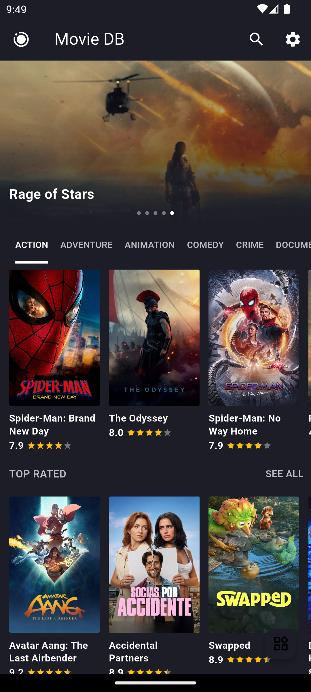
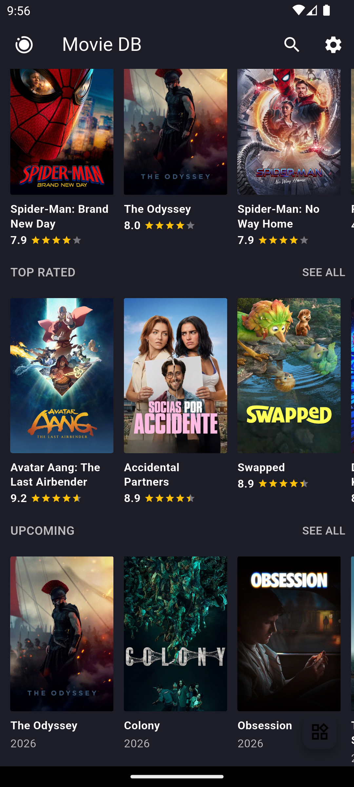
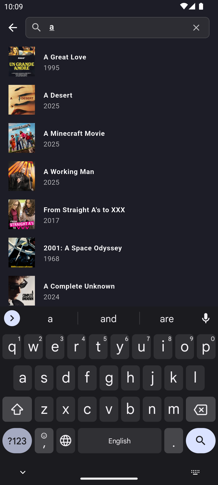
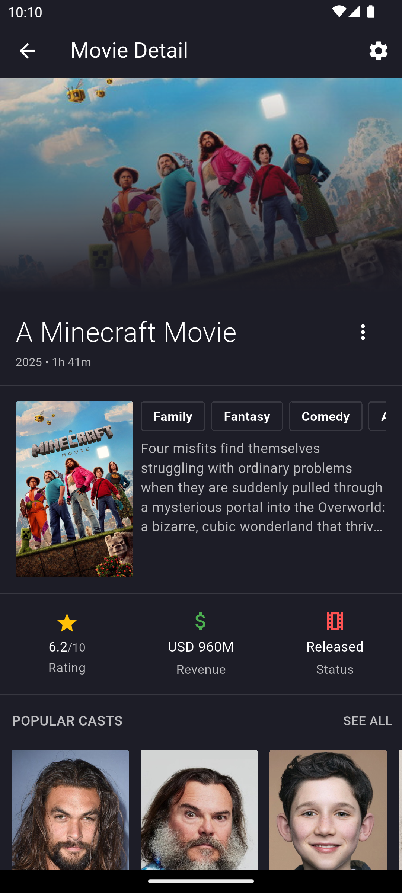
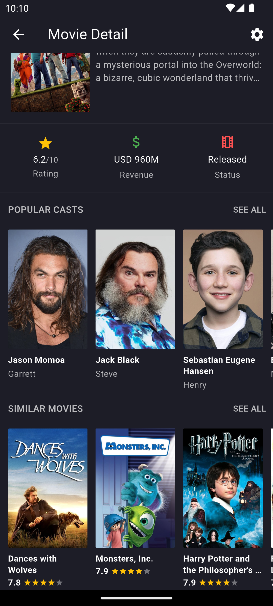
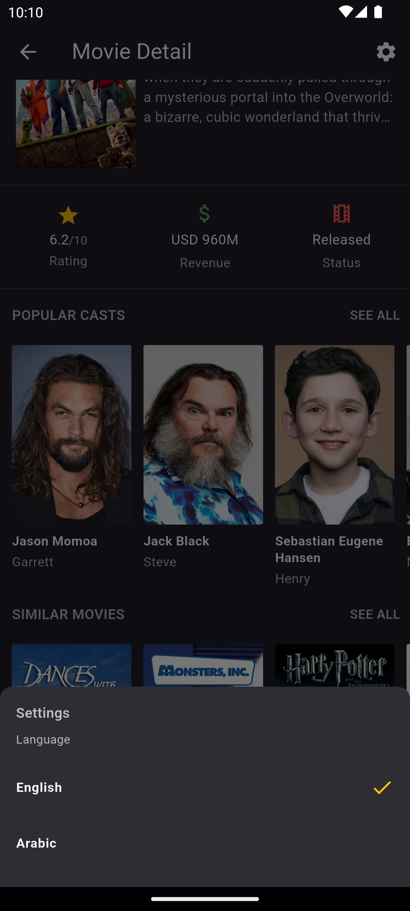
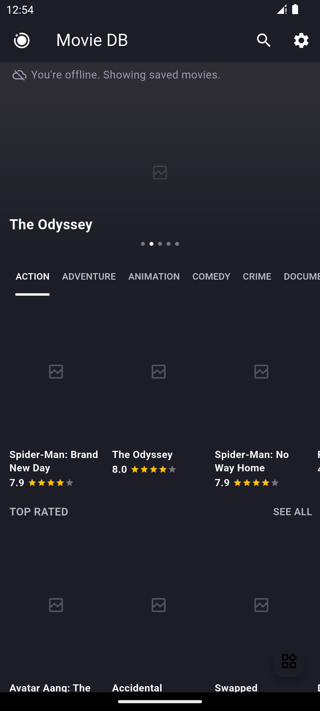
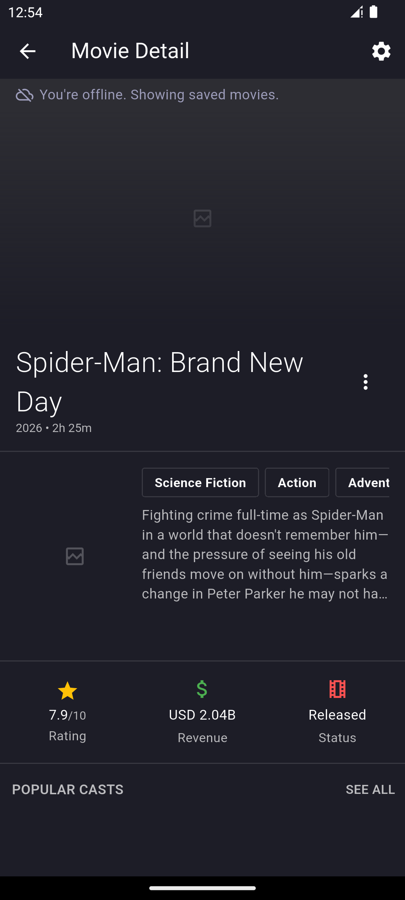

# Movie DB

A Flutter TMDB movie app built for learning **Clean Architecture (feature-first)**, **Cubit** state management, **Retrofit**, and **easy_localization** (English / Arabic).

Inspired by [flutter-tmdbmovie-bloc-cubit](https://github.com/ihsaninh/flutter-tmdbmovie-bloc-cubit) — same dark cinematic UI, rebuilt layer by layer with specs and one-commit-per-step workflow.

## Features

- **Home** — popular carousel, genre tabs, top rated & upcoming rows
- **Search** — debounced TMDB search with loading, empty, and error states
- **Detail** — backdrop carousel, poster, genres, overview, stats, cast, similar movies
- **Navigation** — Home → Search → Detail → Similar → Detail with back stack
- **i18n** — English & Arabic UI; locale switcher in settings
- **Clean Architecture** — domain use cases, Retrofit data layer, Cubit presentation
- **Offline cache** — Hive-backed cache-first SSOT; home and detail work without network

## Screenshots

### Home

Popular carousel, genre discovery, and movie rows.

<p align="center">
  
  
</p>

### Search

Filled search bar with debounced results.

<p align="center">
  
</p>

### Movie detail

Full detail layout with stats, cast, and similar movies.

<p align="center">
  
  
</p>

### Settings (locale)

Switch between English and Arabic from the settings sheet.

<p align="center">
  
</p>

### Offline mode

Cached home and movie detail when the device has no network connection.

<p align="center">
  
  
</p>

## Getting started

### Prerequisites

- [Flutter](https://docs.flutter.dev/get-started/install) (Dart 3.13+)
- A free [TMDB API key](https://www.themoviedb.org/settings/api)

### Setup

```bash
git clone https://github.com/karimelbahi/flutter_tutotial_for_learn.git
cd flutter_tutotial_for_learn
cp .env.example .env
# Edit .env and set API_KEY=your_tmdb_api_key
flutter pub get
flutter run
```

`.env` example:

```env
API_KEY=your_tmdb_api_key_here
BASE_URL=https://api.themoviedb.org/3
IMAGE_URL=https://image.tmdb.org/t/p/w500
```

> **Note:** `.env` is gitignored. Never commit your API key.

### Code generation (after API changes)

```bash
dart run build_runner build
```

### Tests

```bash
dart analyze lib/
flutter test
```

---

## Architecture

```
presentation  →  domain  ←  data
     ↓              ↑
   core (theme, routes, network, tokens)
```

| Layer | Path | Role |
|-------|------|------|
| **Presentation** | `lib/features/movies/presentation/` | Screens, widgets, Cubits |
| **Domain** | `lib/features/movies/domain/` | Entities, repository contracts, use cases |
| **Data** | `lib/features/movies/data/` | Retrofit `TmdbApi`, models, repository impl |
| **Core** | `lib/core/` | Theme, design tokens, Dio, config |

### Data flow

```
Screen → Cubit → UseCase → Repository → DataSource → TmdbApi (Retrofit)
                              ↓
                         Movie entity
```

### App startup

```
main.dart
  → MovieApp.initialize()
  → dotenv.load('.env')
  → DioFactory.configure()
  → TmdbApiProvider.configure()
  → runApp(EasyLocalization → MovieApp)
      → MaterialApp (AppRouter)
          → MovieHomeScreen
```

---

## Tech stack

| Concern | Library |
|---------|---------|
| State | `flutter_bloc` (Cubit only) |
| i18n | `easy_localization` |
| HTTP | `retrofit` + `dio` |
| Env | `flutter_dotenv` |
| UI | `carousel_slider`, `flutter_rating_bar`, `url_launcher` |

---

## Project structure

```
lib/
├── main.dart
├── app/
│   ├── app.dart
│   └── app_router.dart
├── core/
│   ├── config/
│   ├── constants/      # AppColors, AppSpacing, AppTypography
│   ├── network/
│   └── theme/
└── features/movies/
    ├── data/
    │   ├── api/tmdb_api.dart
    │   ├── datasources/
    │   ├── models/
    │   └── repositories/
    ├── domain/
    │   ├── entities/
    │   ├── repositories/
    │   └── usecases/
    └── presentation/
        ├── cubit/
        ├── screens/
        └── widgets/
```

---

## Feature specs

| Spec | Feature | Status |
|------|---------|--------|
| [001-movie-home](specs/001-movie-home/spec.md) | Home feed | Complete |
| [002-movie-search](specs/002-movie-search/spec.md) | Search screen | Complete |
| [003-movie-detail](specs/003-movie-detail/spec.md) | Movie detail | Complete |
| [004-navigation-polish](specs/004-navigation-polish/spec.md) | Navigation & i18n polish | Complete |

See [docs/implementation-plan.md](docs/implementation-plan.md) for the full phase roadmap.

---

## Documentation

| Resource | Path |
|----------|------|
| Implementation plan | [docs/implementation-plan.md](docs/implementation-plan.md) |
| Architecture | [docs/architecture.md](docs/architecture.md) |
| Folder structure | [docs/folder-structure.md](docs/folder-structure.md) |
| Tech stack | [docs/tech-stack.md](docs/tech-stack.md) |
| Development workflow | [docs/development-workflow.md](docs/development-workflow.md) |

### Cursor AI

- **Skill:** `.cursor/skills/flutter-movie-app/SKILL.md`
- **Rules:** `.cursor/rules/flutter-clean-architecture.mdc`

---

## Design tokens

Dark TMDB-style theme (`#1D1D27` background).

| Token | Usage |
|-------|--------|
| `AppColors.primary` | Scaffold background |
| `AppColors.martinique` | Cards, search bar, menus |
| `AppSpacing.moviePosterWidth/Height` | 120 × 180 posters |
| `AppSpacing.carouselHeight` | 220px carousel |

---

## Resources

- [Flutter docs](https://docs.flutter.dev/)
- [TMDB API](https://developer.themoviedb.org/docs)
- [Reference app](https://github.com/ihsaninh/flutter-tmdbmovie-bloc-cubit)
