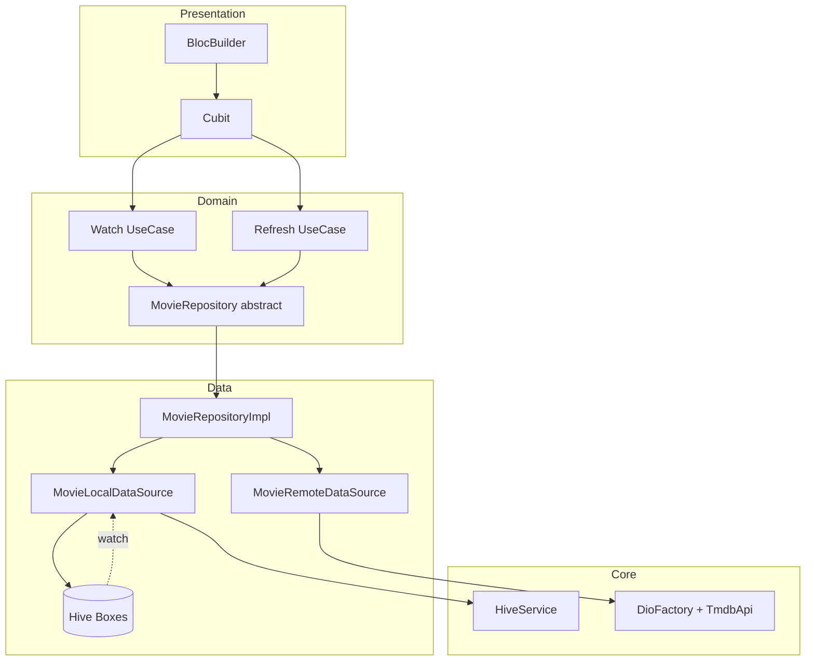

# Implementation Plan: Cache-First Single Source of Truth (SSOT)

**Branch**: `feature/cache-first-ssot-architecture` | **Date**: 2026-08-20 | **Spec**: [spec.md](./spec.md)

**Input**: Feature specification from `/specs/005-cache-first-ssot/spec.md`

## Summary

Introduce **Hive-backed local persistence** as the **Single Source of Truth** for all UI-bound movie data (home lists, detail, cast, similar). Repositories expose **`watch*()` streams** backed by Hive `Box.watch()`. Cubits subscribe to local streams, emit cached data immediately, and trigger **background network refresh** that writes to Hive (never directly to UI). Search remains **network-first** in v1.

## Technical Context

**Language/Version**: Dart 3.13+ / Flutter 3.47 (stable)

**Primary Dependencies**: `hive`, `hive_flutter`, existing `flutter_bloc`, `retrofit`, `dio`

**Storage**: Hive boxes for movie lists, detail, cast, similar + metadata timestamps

**Testing**: Repository unit tests (cache hit/miss/offline); update cubit fakes; `flutter test` + `dart analyze lib/`

**Target Platform**: iOS + Android

**Constraints**: Cubit-only; Retrofit network unchanged; en/ar i18n for stale/offline banner; design tokens

**Scale/Scope**: 1 feature (`movies`), ~8 cubits touched (7 cache-first, 1 search unchanged), core `HiveService`

## Constitution Check

| Principle | Status | Notes |
|-----------|--------|-------|
| I. Clean Architecture | ✅ PASS | Local datasource in `data/`; domain gets abstract watch/refresh on repository |
| II. Cubit-only | ✅ PASS | Cubits subscribe to `Stream`s from use cases; no Riverpod |
| III. Localization | ✅ PASS | Add `cache.stale`, `cache.offline` keys if banner shown |
| IV. Reference-driven UI | ✅ PASS | No layout changes except optional stale chip/banner |
| V. Security & Simplicity | ✅ PASS | Hive for cache only; secrets stay in `.env` |
| VI. Cache-First SSOT | 🆕 NEW | This spec implements the new principle |

**Post-design re-check**: Domain entities unchanged; Hive stores serialized **models** (DTOs) mapped to entities at repository boundary.

## Architecture — Target Data Flow

### Before (remote-only)

```
Cubit.load() → UseCase → Repository.get*() → RemoteDataSource → TmdbApi
  → emit Loading → emit Success/Failure
```

### After (cache-first SSOT)

```
Cubit.load()
  ├─ subscribe UseCase.watch*() ← Repository.watch*() ← Hive Box.watch()
  │     → emit Success(cached) immediately when cache non-empty
  └─ UseCase.refresh*() ← Repository.refresh*()
        → RemoteDataSource → TmdbApi → LocalDataSource.save → Hive
        → Box.watch fires → stream re-emits → Cubit updates UI

On refresh failure:
  - cache non-empty → keep Success + isStale/isOffline flag
  - cache empty     → emit Failure
```



## Hive Box Design

| Box name | Key pattern | Value type | Notes |
|----------|-------------|------------|-------|
| `movies_lists` | `popular`, `top_rated`, `upcoming`, `genre_{id}` | `List<MovieModel>` (JSON list or typed adapter) | Single box, string keys |
| `movie_details` | `{movieId}` | `MovieDetailModel` | Per-movie |
| `movie_cast` | `{movieId}` | `List<CastMemberModel>` | Per-movie |
| `similar_movies` | `{movieId}` | `List<MovieModel>` | Per-movie |
| `cache_metadata` | same as data keys | `CacheMetadata` (fetchedAt) | TTL checks |

**Adapter strategy**: Use **manual JSON serialization** via existing `fromJson`/`toJson` on models stored as `Map`/`List` in Hive (avoids code-gen churn for v1). Optionally migrate to `@HiveType` adapters in a follow-up if performance requires it.

## Code Structure (new / modified)

```text
lib/core/storage/
├── hive_service.dart              # init, open boxes, register adapters if any
├── cache_config.dart              # TTL constants
└── cache_metadata.dart            # fetchedAt model + helpers

lib/features/movies/data/
├── datasources/
│   ├── movie_remote_data_source.dart   # unchanged API surface
│   └── movie_local_data_source.dart    # NEW: save, get, watch*
├── repositories/
│   └── movie_repository_impl.dart      # REFACTOR: watch + refresh

lib/features/movies/domain/
├── repositories/movie_repository.dart  # ADD watch* + refresh* methods
└── usecases/
    ├── watch_popular_movies.dart       # NEW
    ├── refresh_popular_movies.dart     # NEW
    └── ... (mirror for each cached resource)

lib/features/movies/presentation/cubit/
├── popular_movies_cubit.dart           # REFACTOR: stream subscription
├── popular_movies_state.dart           # ADD isStale / isRefreshing optional
└── ... (top_rated, upcoming, genre, detail, cast, similar)
    # search_movies_cubit.dart — UNCHANGED (network-first)

lib/main.dart                           # HiveService.init() before runApp
```

## Repository Contract (domain)

Extend `MovieRepository`:

```dart
// Home lists — cache-first
Stream<List<Movie>> watchPopularMovies();
Future<Result<void>> refreshPopularMovies();

Stream<List<Movie>> watchTopRatedMovies();
Future<Result<void>> refreshTopRatedMovies();

Stream<List<Movie>> watchUpcomingMovies();
Future<Result<void>> refreshUpcomingMovies();

Stream<List<Movie>> watchMoviesByGenre(int genreId);
Future<Result<void>> refreshMoviesByGenre(int genreId);

// Detail — cache-first
Stream<MovieDetail?> watchMovieDetail(int movieId);
Future<Result<void>> refreshMovieDetail(int movieId);

Stream<List<CastMember>> watchMovieCast(int movieId);
Future<Result<void>> refreshMovieCast(int movieId);

Stream<List<Movie>> watchSimilarMovies(int movieId);
Future<Result<void>> refreshSimilarMovies(int movieId);

// Search — network-first (unchanged)
Future<Result<List<Movie>>> searchMovies(String query);

// Deprecate/remove one-shot get* for cached resources after cubit migration
```

Keep existing `get*` methods temporarily as thin wrappers (`refresh` + single read) for test compatibility, then remove in final cleanup task.

## Cubit Pattern

```dart
class PopularMoviesCubit extends Cubit<PopularMoviesState> {
  StreamSubscription<List<Movie>>? _subscription;

  Future<void> load() async {
    await _subscription?.cancel();
    _subscription = _watchPopularMovies().listen(
      (movies) {
        if (movies.isEmpty && state is! PopularMoviesFailure) {
          emit(const PopularMoviesLoading());
          return;
        }
        emit(PopularMoviesSuccess(
          movies,
          isStale: _lastRefreshFailed,
          isRefreshing: _isRefreshing,
        ));
      },
    );
    await _refresh();
  }

  Future<void> _refresh() async {
    _isRefreshing = true;
    final result = await _refreshPopularMovies();
    _isRefreshing = false;
    _lastRefreshFailed = result.isFailure && _hasCache;
    // stream listener handles emit
  }

  @override
  Future<void> close() {
    _subscription?.cancel();
    return super.close();
  }
}
```

## Error & Stale Handling

| Scenario | Cubit behavior |
|----------|----------------|
| Cache hit, refresh succeeds | Success, `isStale: false` |
| Cache hit, refresh fails | Success with cached data, `isStale: true` |
| Cache miss, refresh succeeds | Loading → Success |
| Cache miss, refresh fails | Failure with localized message |
| Corrupt cache entry | LocalDataSource clears key; treat as cache miss |

## Testing Strategy

1. **MovieLocalDataSource** — in-memory Hive or test box: save, read, watch emits on write
2. **MovieRepositoryImpl** — mock remote + real/fake local: verify write-on-success, watch-before-refresh
3. **Cubit** — mock watch stream + refresh: verify no Loading flash when cache exists
4. **Search** — existing tests unchanged

## Migration / Rollout

1. Add Hive infra without changing UI behavior (infra task)
2. Migrate one vertical slice (popular movies) end-to-end; validate manually
3. Replicate pattern for remaining home rows + detail sections
4. Remove deprecated `get*` one-shot paths
5. Update `docs/architecture.md` data-flow section

## Risks & Mitigations

| Risk | Mitigation |
|------|------------|
| Stream memory leaks | Cancel subscriptions in `Cubit.close()` |
| Double emit flicker | Don't emit Loading when cache non-empty |
| Stale genre tab data | Key by `genre_{id}` |
| Hive init failure | Fail fast in debug; log + network-only fallback in release (optional) |

## Delivery Strategy — Commit-by-Commit

See [tasks.md](./tasks.md) for granular tasks. Each task maps to:

`feat(cache-ssot): <description>`

followed by `git push origin feature/cache-first-ssot-architecture`.
